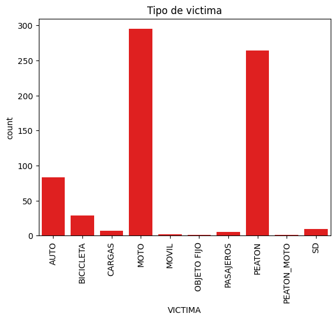

# Proyecto Data Analytics: (SINIESTROS VIALES EN BUENOS AIRES)

## Descripción

Bienvenido al repositorio del Proyecto SINIESTROS VIALES EN BUENOS AIRES. Este proyecto es una aplicación [de metodos de analisis, en casos de siniestros viales en la ciudad de Buenos Aires(Argentina)]. Aquí encontrarás una visión general detallada del proyecto, así como información sobre las tecnologías utilizadas, la metodología aplicada y análisis exhaustivos de los datos.

## Visión General

Los siniestros viales, también conocidos como accidentes de tráfico o accidentes de tránsito, son eventos que involucran vehículos en las vías públicas y que pueden tener diversas causas, como colisiones entre automóviles, motocicletas, bicicletas o peatones, atropellos, choques con objetos fijos o caídas de vehículos. Estos incidentes pueden tener consecuencias que van desde daños materiales hasta lesiones graves o fatales para los involucrados.

Los decesos o incluso lesiones por estos acontecimientos suelen ser un indicador grave para cada una de las ciudades en este caso analizaremos lo registros del año 2016 al año 2021. 

La intencion es encontrar posibles mejoras como pueden ser  educación vial, el cumplimiento de las normas de tráfico, la infraestructura segura de carreteras y calles, así como la promoción de vehículos más seguros. 

## Tecnologías Utilizadas

- para llevar a cabo este proyecto se utlizo:
  - Python como lenguaje de programacion
  - librerias: pandas, numpy,matplotlib,seaborn.
  - Power Bi
  - archivos de Jupyter Notebook 
  - creacion de entornos virtuales para la correcta ejecucion en la consola de gitbash
  - MySQL como motor de bases de datos 
  - archivos en formatos .xlsx
  

## Metodología

- se inicio con la obtencion de los datasets.
- se cargaron los datos y se transformaron con la libreria pandas.
- se creo un Analisis Exploratorio de los Datasets.
- se crearon graficos en el analisis con las librerias matplotlib y seaborn.
- se creo un dashboard en Pöwer Bi siguiendo la metodoliga SMART. 

## Análisis de Datos

En esta sección, proporcionamos análisis detallados de los datos utilizados en el proyecto. Esto incluye estadísticas, visualizaciones y cualquier otra información relevante.
    
    
    - En la carpeta Datas se encuentran 2 archivos .xlsx
        - homicidios.xlsx 
        - Lesiones.xlsx  

   - En el archivo EDA.ipynb
    
    - Se realizo el analisis y entendimiento de los datasets asi como la realizacion de graficos y notas alusivas a las conclusiones obtenidad por cada uno de ellos

### Archivo: Homicidios hoja: "Hechos"
 - podemos destacar la cantidad de homicidios en siniestros viales por año, donde muestra que los años con mayor cantidad de accidentes fueron 2016 y 2018, siendo el año 2020 el año 

- La Ciudad de Buenos Aires se encuentra organizada en 15 Comunas que se rigen bajo la Ley 1.777 sancionada en 2005. Se trata de unidades descentralizadas de gestión política y administrativa que, en algunos casos, abarcan a más de un barrio porteño.
La comuna con mas accidentes es la comuna #1 y la de menor cantidad de accidentes es la comuna #6 
datos obtenidos de: link:https://buenosaires.gob.ar/jefaturadegabinete/atencion-ciudadana-y-gestion-comunal/gestion-comunal/comunas#:~:text=Comuna%201%20Retiro%2C%20San%20Nicol%C3%A1s%2C%20Puerto%20Madero%2C%20San,La%20Boca%2C%20Barracas%2C%20Parque%20Patricios%2C%20y%20Nueva%20Pompeya

 * NOTA: el grafico nos representa la COMUNA #0 la cual dentro de los registros de Buenos Aires(Argentina), no existe aunque solo son 2 casos de accidentes registrados podemos determinar que estos acidentes no cuentan con un registro real de el lugar de los hechos.
 * NOTA_2: revisando los datos encontramos que los accidentes en COMUNA #0 ocurrieron en la AUTOPISTA 25 DE MAYO que esta ubicada en la COMUNA #1 por lo tanto para tener una mejor representacion se cambiara el valor de la comuna en esos casos.  

### Archivo "homicidios": hoja "VICTIMAS"

- Encontramos que las personas en moto son las que mas decesos muestran, esto podria ser a la falta de conciencia vial, o no seguir las normas de vialidad de la zona, no portar el equipo necesario para circular en motocicleta o incluso, las condiciones de las vialidades podrian influir 

- el genero masculino es el mas afectado, se econtro una notable diferencia en cantidad de homicidios en comparacion con el genero femenino.

### Archivo: "lesiones" hoja: "HECHOS"

La densidad de los puntos varía en diferentes áreas, lo que sugiere que la densidad de accidentes también varía en estas áreas.
Esto significa que hay áreas específicas donde ocurren más accidentes. Es posible que este patrón se deba a una variedad de factores, como la densidad de tráfico, las condiciones de la carretera, entre otros.

Encontramos que la comuna 1 tiene la mayor cantidad total de transportes, con un número significativo de transporte público.
Las comunas 2 a 15 muestran una distribución más o menos uniforme de los tipos de transporte, con las motos y los autos siendo los más comunes.
Esto sugiere que la comuna 1 tiene una mayor dependencia del transporte público en comparación con las otras comunas.

### Archivo: "lesiones" hoja: "VICTIMAS"

En este grafico encontramos un dato muy llamativos el cual es que para el año la cantidad de accidentes en la ciudad de Buenos Aires disminuyo considerablemente y volvio a crecer para el año 2021

encontramos datos atipicos en el registro de las edades, sin embargo no se pueden descartar ya que podrian ser personas adultas o niños de corta edad involucrados en algun accidente vial.

### Archivo: "Dashboard Siniestros Viales.pbix"

- Dentro del Dashboard podemos observar algunos kpis para el resultado de los años 2021 ya que sin daatos actualizados no es posible generar una proyeccion en respecto a años posteriore, se tomaron en cuenta rangos de tiempo medibles y alcanzables para realizar los kpi's

## Conclusiones

En conclusion La investigación ha demostrado que existen algunos patrones en los datos, como que los conductores de "MOTO" son mas propensos a estar involucrados en algun siniestro dando como resultado lesiones graves o inlcuso la muerte. se presentan una gran diferencia en registros del genero masculino a comparacion con el Genero Femenino, la edad promedio de las personas involucradas en los siniestros oscila entre los 38 y 40 años.
las comunas mas concurridas son las que mas accidentes tienen, podria ser por condidciones de las vialidades o incluso por no seguir las normas de manejo. 

Podriamos comenzar a evitar esto con campañas de cociencia vial, con la reapracion o mejora de las vialidades, incluso destinando carriles especiales apra el transporte publico.

## Contacto

- Autor: Joshua Giovanni Esquivel Fuentes
- Correo Electrónico: jg.esquivel@outlook.com
- LinkedIn: La investigación ha demostrado que 